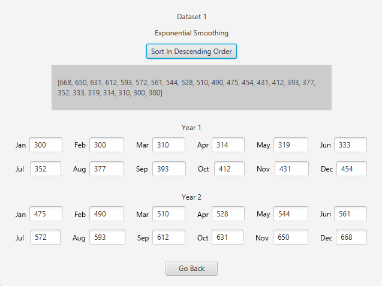

# Forecasting Car Sales

## Overview
An advanced forecasting application that predicts product sales for the next two years using four different forecasting methodologies. By analyzing historical monthly sales data from the past two years, this tool provides accurate projections to support business planning and inventory management.

## Features

- **Multiple Forecasting Methods**: Implements Exponential Smoothing, Double Exponential Smoothing, Regression Analysis, and Deseasonalized Regression Analysis
- **Interactive Visualization**: Graphical representation of forecasted sales data
- **Data Management**: Add, view, update, and delete datasets
- **Performance Metrics**: Compare methods using MSE (Mean Squared Error) and min/max forecasted sales
- **Persistent Storage**: MongoDB integration for reliable data management

## Technology Stack

- **Frontend**: JavaFX with FXML
- **Database**: MongoDB
- **Language**: Java

## User Interface

### Main Dashboard
The application starts with an intuitive main screen displaying your datasets. Each dataset is automatically named according to its creation date, though custom naming is available.

### Data Management

#### Viewing & Updating Data
Select any dataset and click the View/Update button to access detailed records and modify individual entries as needed.

#### Record Modification
Each record is contained in an editable text field, allowing for easy corrections without recreating entire datasets.

Changes are automatically synchronized with the MongoDB database:

#### Adding New Datasets
The Add Dataset menu provides a streamlined interface for importing new sales data.

Successful additions are immediately reflected in both the UI and database:

#### Removing Datasets
Delete any selected dataset with a single click, which removes it from both the UI and database.

## Database Architecture

Each dataset is stored with a unique identifier and structured for optimal performance:

## Forecasting Capabilities

### Method Comparison
Select any dataset and click "Get forecast" to compare all available forecasting methods:

The system provides key metrics including minimum/maximum forecasted sales and Mean Squared Error (MSE) to help you select the most appropriate method for your data.

### Forecast Visualizations

After selecting your preferred method, view detailed month-by-month projections for the next two years:

#### Exponential Smoothing

#### Double Exponential Smoothing

#### Regression Analysis

#### Deseasonalized Regression Analysis

